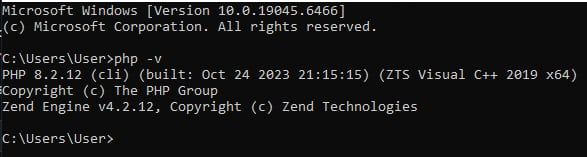
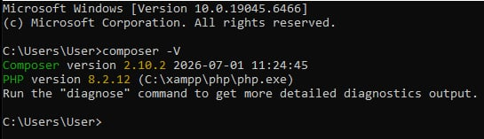
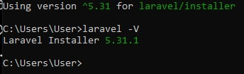
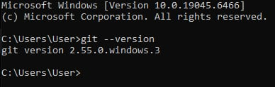
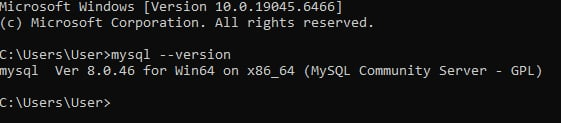
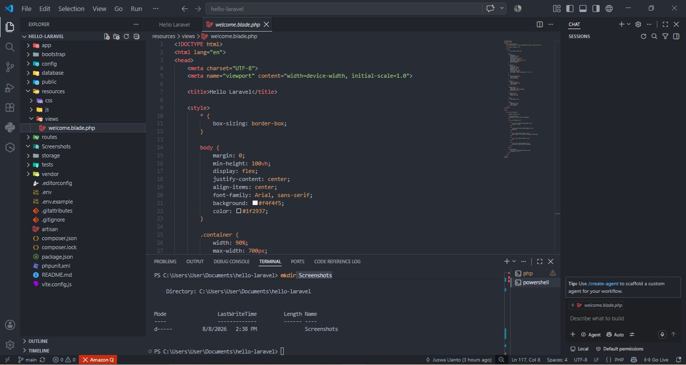
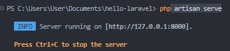
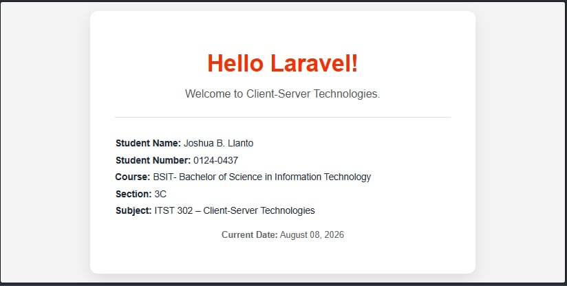

# Hello Laravel

## Introduction

Laravel is a PHP web application framework that makes web development easier and more organized by providing built-in tools for common development tasks. Client-Server Technologies are important because they allow users and applications to communicate with servers that process requests, manage data, and provide responses. The purpose of this project is to practice setting up a Laravel development environment and creating a basic Laravel application while learning how PHP, Composer, Laravel, Git, MySQL 8.0, XAMPP, and Visual Studio Code work together. The project also demonstrates creating and customizing a Laravel homepage and managing the project using Git and GitHub.

## Project Features

- Laravel development environment setup
- Customized Hello Laravel homepage
- Application information route
- MySQL 8.0 database environment
- Git and GitHub version control
- Documented installation and configuration process

## Objectives

* To install and configure the required tools for Laravel development, including PHP, Composer, Laravel, Git, MySQL 8.0, XAMPP, and Visual Studio Code.
* To create and configure a basic Laravel project.
* To understand the basic structure and components of a Laravel application.
* To customize a Laravel homepage with the required student information.
* To run and test the Laravel application using the built-in development server.
* To use Git for version control and upload the project to GitHub.
* To document the installation and development process through screenshots and a README file.

## Development Environment

The project was developed using the following hardware and software environment:

| Component | Version |
|---|---|
| Operating System | Windows 10/11 |
| PHP |  8.5 |
| Laravel |  5.31.1 |
| Composer | 2.10.2 |
| Git | 2.55.0 |
| MySQL | 8.0.46 |
| Visual Studio Code |  1.132.0 |

## Installation Steps

The following steps describe the installation and setup process used to prepare the Laravel development environment.

### Step 1: Install PHP

PHP was installed and configured so that it could be accessed through the command line. After installation, the PHP version was verified using the command `php -v`.

---

### Step 2: Install Composer

Composer was installed as the dependency manager for PHP and Laravel. After installation, the Composer version was verified using the command `composer -V`.

---

### Step 3: Install Laravel

The Laravel installer was installed using Composer. The installation was verified using the command `laravel -V`.

---

### Step 4: Install Git

Git was installed and configured for version control. The installation was verified using the command `git --version`.

---

### Step 5: Install MySQL 8.0

MySQL Server 8.0 was installed and configured as part of the database environment. The installation was verified using the command `mysql --version`.

---

### Step 6: Set Up the Laravel Project in Visual Studio Code

The Laravel project was created in the directory `C:\Users\User\Documents\hello-laravel`.

The project was then opened in Visual Studio Code for development.

---

### Step 7: Run the Laravel Application

After creating and configuring the Laravel project, the Laravel development server was started using the command `php artisan serve`.

The application was accessed through `http://127.0.0.1:8000`.

---

### Step 8: View the Customized Laravel Homepage

The Laravel homepage was customized to display the required student information, including the student's name, student number, course, section, subject, and current date.

The completed homepage was accessed through the local Laravel development server.

## Project Structure

Laravel follows a structured project organization where different folders are responsible for different parts of the application. The following are the important Laravel folders used in this project:

### app/

The `app/` folder contains the core application code. It is mainly used for application logic, models, controllers, and other PHP classes.

### routes/

The `routes/` folder contains the route definitions of the application. Routes determine how the application responds to different URLs and requests.

### resources/

The `resources/` folder contains the application's views and frontend resources. In this project, the customized Laravel homepage was created inside the `resources/views/` directory.

### public/

The `public/` folder contains files that are directly accessible by users through the web browser. It also contains the main entry point of the Laravel application.

### config/

The `config/` folder contains the configuration files used by the Laravel application. These files allow different application settings to be configured.

### database/

The `database/` folder contains files related to the application's database, including migrations, seeders, and factories.

## Problems Encountered

### Problem 1: ZIP Extension Error

Composer could not install Laravel because the PHP ZIP extension was disabled.

### Problem 2: Git Was Not Recognized

The `git` command was not recognized because Git was not properly installed or configured.

### Problem 3: MySQL Showed MariaDB

The MySQL command initially showed the MariaDB version from XAMPP instead of MySQL 8.0.

### Problem 4: Laravel Folder Was Not Empty

Laravel could not create the project because the `hello-laravel` folder already contained files.

## Solutions

### Solution 1: Enable ZIP Extension

The `extension=zip` line was enabled in the `php.ini` file. Composer was then able to install the required packages.

### Solution 2: Install Git

Git was installed and added to the system PATH. The installation was verified using `git --version`.

### Solution 3: Install MySQL 8.0

MySQL Server 8.0 was installed separately. The installation was verified using `mysql --version`.

### Solution 4: Use the Existing Laravel Project

The existing `hello-laravel` project was opened in Visual Studio Code instead of creating another project in the same folder.

## Screenshots

The following screenshots document the installation, configuration, and successful execution of the Laravel development environment.

### Screenshot 1: PHP Version

This screenshot shows the installed PHP version used for the Laravel development environment.

### Screenshot 2: Composer Version

This screenshot shows the installed Composer version used to manage PHP and Laravel dependencies.

### Screenshot 3: Laravel Version

This screenshot shows the installed Laravel version.

### Screenshot 4: Git Version

This screenshot shows the installed Git version used for project version control.

### Screenshot 5: MySQL Version

This screenshot shows the installed MySQL Server 8.0 version.

### Screenshot 6: Visual Studio Code

This screenshot shows the Laravel project opened and managed in Visual Studio Code.

### Screenshot 7: Laravel Development Server

This screenshot shows the Laravel development server running successfully using Artisan.

### Screenshot 8: Customized Laravel Homepage

This screenshot shows the completed customized Laravel homepage displaying the required student information.

## Reflection

Through this project, I learned how to set up a Laravel development environment and how different tools work together in web development. I learned how to install and configure PHP, Composer, Laravel, Git, MySQL 8.0, XAMPP, and Visual Studio Code. I also learned how to create a Laravel project, open it in Visual Studio Code, run it using `php artisan serve`, and customize the Laravel homepage. I also gained experience using Git and GitHub to manage and store my project.

During the installation, I encountered several challenges. Composer could not install some required packages because the PHP ZIP extension was disabled. I solved this by enabling the ZIP extension in the `php.ini` file. Git was also not recognized in the command line, so I had to install and configure Git properly. Another challenge was that the MySQL command initially showed MariaDB from XAMPP instead of MySQL 8.0. I solved this by installing MySQL Server 8.0 separately and verifying its version.

Laravel is important in client-server development because it provides a structured way to build web applications. It helps organize important parts of an application such as routes, resources, application code, and database files. Laravel also makes it easier for developers to create applications that can handle client requests and communicate with the server.

This project will help me in future software development because I now have a better understanding of how to prepare a development environment, create a web application, and troubleshoot common installation problems. I also learned how to use Git and GitHub for version control. These skills will be useful when working on larger projects, especially when collaborating with other developers and building more advanced client-server applications.

## References

Laravel. (n.d.). *Laravel documentation*. https://laravel.com/docs

PHP Documentation Group. (2026). *PHP manual*. https://www.php.net/manual/en/

Composer. (n.d.). *Composer documentation*. https://getcomposer.org/doc/

Git. (2026). *Git documentation*. https://git-scm.com/docs/git